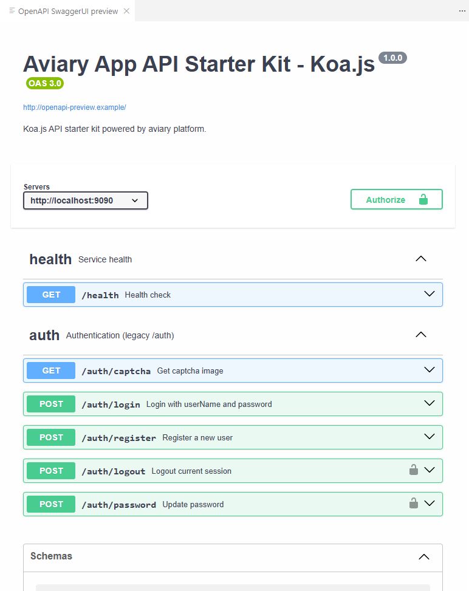

# Aviary App API Starter Kit

Koa.js API starter kit for building modular and scalable backend services on Aviary Platform.

## Features

- Authentication with JWT
- User registration and login
- Password management
- Session management with Redis
- MySQL database with Sequelize
- Clean architecture using aviary-packages

## Prerequisites

- Node.js 18+
- MySQL 5.7+
- Redis 6+
- pnpm (recommended)

### Running with Docker

   ```bash
   docker compose up -d
   ```

## Setup

1. **Configure environment**:

   ```bash
   cp .env.example .env
   # Edit .env with your settings
   ```

2. **Install dependencies**:
   ```bash
   pnpm install
   ```

## Development

Start the development server:

```bash
pnpm dev
```

Use the swagger.json file in the root directory to explore the API endpoints.


